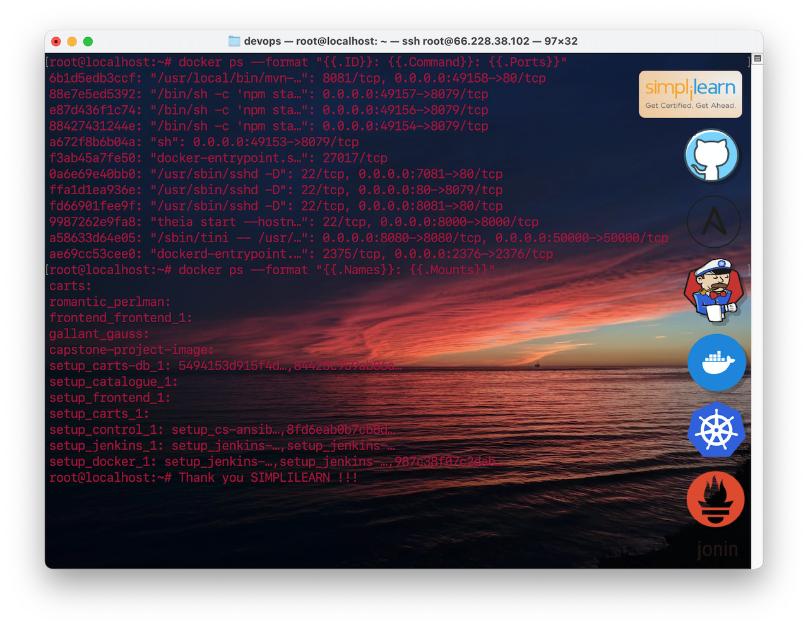

# Overview

Aetna is a leading US healthcare company in the United States. 
The company has 12-week release cycle of which business was impacted 
due to the legacy software process. The company wants to adopt 
the DevOps practices to gain true business value through faster feature releases, 
service and code quality, and cost optimization. The objective of this CI/CD 
Pipeline is to implement iterative deployments, continous innoovation, 
and automated testing throughout the lifecycle of Development ad Operations.

Learn more: (http://34.152.53.235).

## Docker Agents to run Jenkins Jobs


The application is designed to automatically deploy code from Developers
using Github to the Jenkins CI/CD pipeline on Ansible Hosts. The application consists
of the following components:

*   **GitHub** - stores all code from Developers using Git.

*   **Ansible** - implements the infrastructure as code and configuration
    hosts managment using Docker-Compose file.
    
*   **Jenkins** - runs a pipeline using Blue Ocean plugin to package the
    application for Docker inside Docker using Jenkisfile.

*   **Docker** - hosts the image creation using Dockerfile and Docker Hub.
    This process is automated using Blue Ocean to build, package, and publish the image.

*   **Kubernetes** - manages the container image on a Pod and provides Load Balancing
    of the Capstone clusters.

*   **Prometheus and Grafana** - provides a user interface for querying Prometheus
    about the metrics and visualizes the metrics in pre-configured dashboards.

## Architecture


### Configuration

*   The docker-compose.yml initiates the container setup for the Capstone Project.
    The live code workspace environment is shown here: (http://66.228.38.102:8000).
    
*   The Docker Host or simply called Docker inside Docker to launch container images
    whenever there is a push commit to be able to expose the application to the web.
    The pipeline commence on Start > Build > Test > Package > Deploy > Publish. The
    Jenkins plugin Blue Ocean is able to deploy docker agents for Jenkins jobs.
    
    


### Jenkinsfile

```shell
pipeline{

    agent any  

    stages{
        stage('build'){
            steps{
                echo 'this is the build job'
                sh 'npm install'
            }
        }
        stage('test'){
            steps{
                echo 'this is the test job'
                sh 'npm test'
            }
        }
        stage('package'){
            steps{
                echo 'this is the package job'
                sh 'npm run package'
                archiveArtifacts '**/distribution/*.zip'
            }
        }
    }
}

```

### Dockerfile

```shell
FROM node:4-alpine


WORKDIR /opt/frontend

COPY . .

RUN npm install

EXPOSE 8079

CMD npm start

```

#### Clone this repo

Clone this repo and the associated tools repo:

```shell
git clone --recursive https://github.com/jonindevops/capstone.git
```


